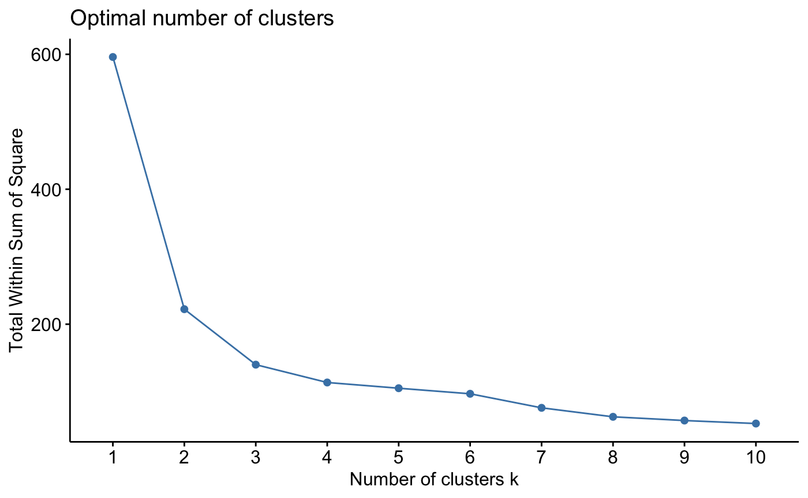
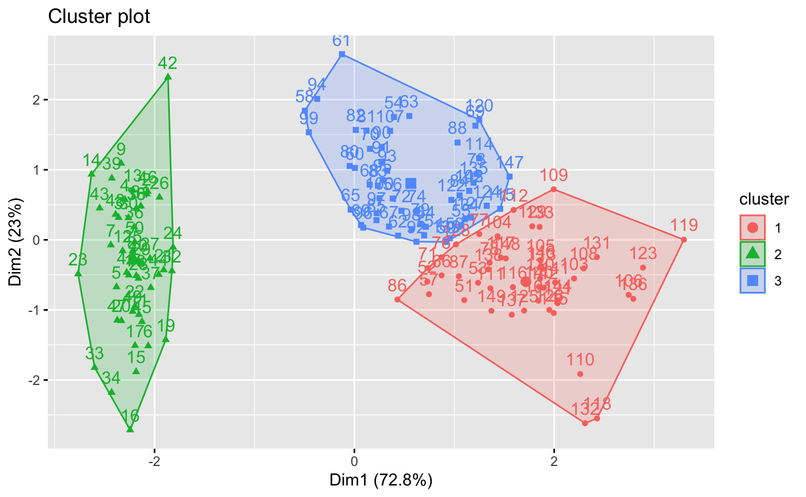

# Task 2: Iris Clustering

This task uses K-means clustering to identify groups in the Iris dataset.

## Workflow

- Import and inspect the measurements
- Remove missing observations
- Standardise the numerical features
- Use the elbow method to inspect the number of clusters
- Fit a three-cluster K-means model
- Visualise the resulting clusters

## Files

- [`iris-clustering.Rmd`](./iris-clustering.Rmd) — clustering analysis
- [`data/iris.csv`](./data/iris.csv) — source dataset
- [`outputs/optimal-number-of-clusters.png`](./outputs/optimal-number-of-clusters.png) — elbow-method chart
- [`outputs/cluster-plot.png`](./outputs/cluster-plot.png) — K-means cluster visualisation

## Visualisations

### Optimal number of clusters

### K-means cluster plot

## Tools

R, R Markdown, factoextra and cluster.
