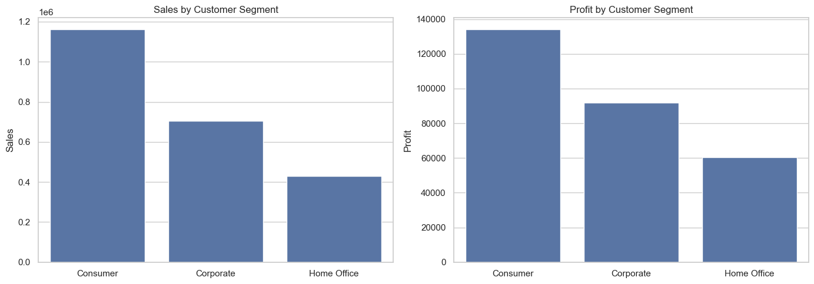
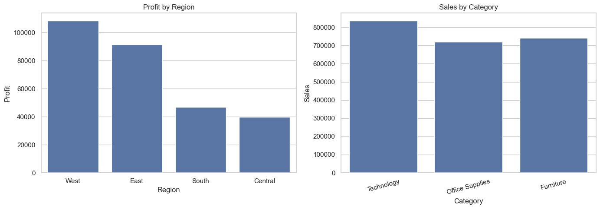
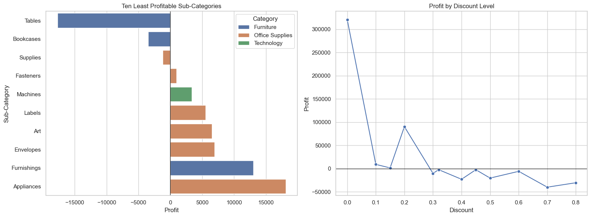

# Task 3: Retail Data Analysis

This Jupyter Notebook explores the Sample Superstore dataset to identify sales, profitability and customer-segment patterns.

## Analysis completed

- Cleaned and validated the dataset
- Examined sales and profitability
- Compared regions, categories and sub-categories
- Investigated customer segments
- Identified loss-making categories, sub-categories and markets
- Presented evidence-based business recommendations

## Files

- [`retail-eda.ipynb`](./retail-eda.ipynb) — complete exploratory analysis notebook
- [`data/sample_superstore.csv`](./data/sample_superstore.csv) — source dataset
- [`requirements.txt`](./requirements.txt) — Python dependencies
- [`outputs/`](./outputs/) — charts produced by the analysis

## Key visuals

### Customer-segment performance



### Regional and category performance



### Sub-category profitability and discount impact



## Run the notebook

Install the dependencies, then open the notebook in JupyterLab or Jupyter Notebook:

```bash
pip install -r requirements.txt
jupyter lab
```

## Data limitations

The supplied data has no product name, customer ID, order ID or order date. The notebook therefore analyses categories, sub-categories, regions and customer segments; it does not make product-level, customer-level or time-series claims.
